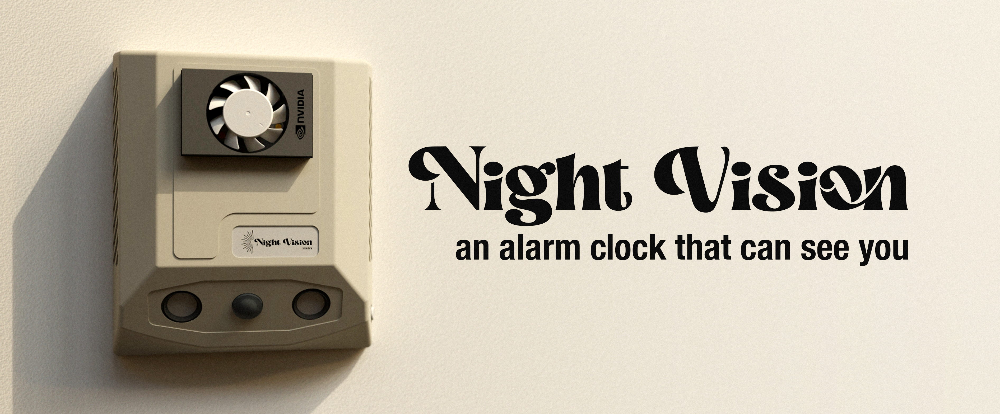
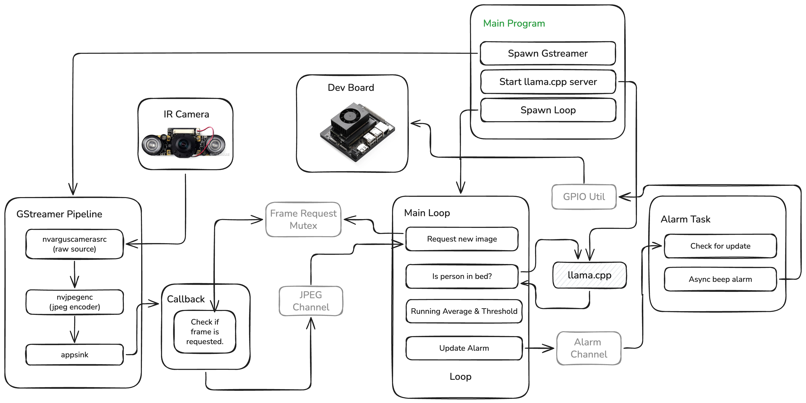
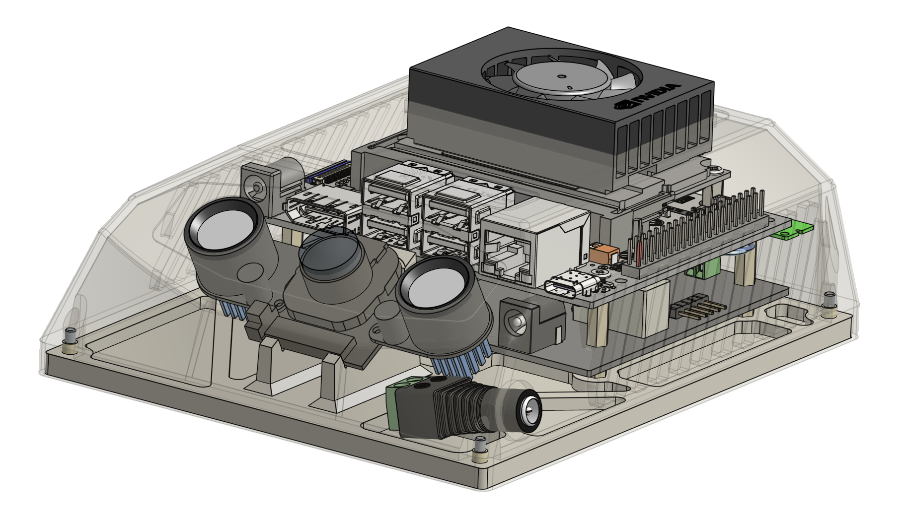
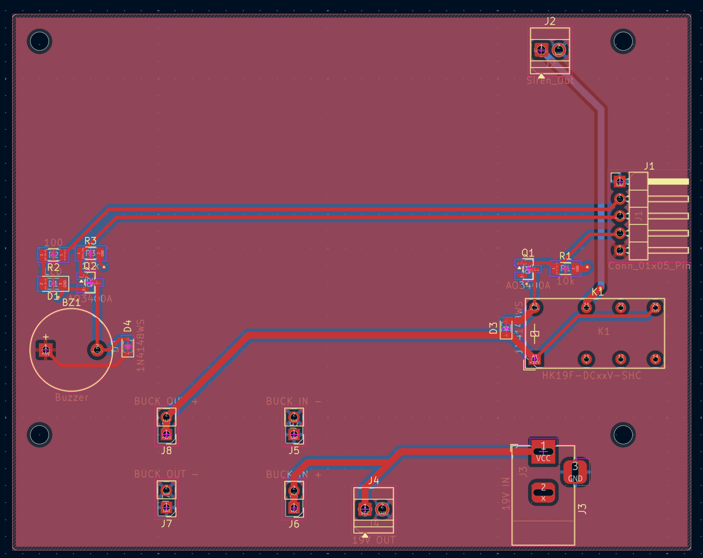

## Overview

Getting up in the morning sounds simple, but for many people, the hardest part is staying out of bed after the alarm goes off. Traditional alarms only solve half the problem: they can wake you up, but they can’t stop you from crawling back under the covers five minutes later.

Night Vision takes a different approach; it's an AI-powered alarm clock that uses an infrared camera and a fully local AI model to determine whether you’re still in bed. The alarm goes off at your set time, and only turns off when it sees you get out of bed. If the system detects that you’ve gone back to bed, the alarm starts again automatically. Once you’re actually up, it stays silent.

## Privacy

Having a camera pointed at your bed is unnerving to most people. However, it's really no different than having your phone camera near your bed. Nothing is being sent over the web: the photos are streamed directly to an on-prem vision-language model, and are never even written to disk. 

## Technical Overview

This project is implemented in Rust on a Jetson Orin Nano dev board. This is more of an embedded project than an AI project. Fast iteration is desired, so the following system was chosen in an attempt to maximize efficiency.

### GStreamer

The [`gstreamer-rs`](https://crates.io/crates/gstreamer) crate was used to implement GStreamer directly in Rust. This allows frames to be read directly from a callback function. This bypasses any network or file I/O, and doesn't need to make any kernel calls whatsoever because everything happens in shared memory[^1]. 

There is a bit of time lost between requesting a frame in the "Frame Request Mutex" and the time the callback is triggered. However, the current implementation prefers a more recent frame over the fastest frame. There is no point in running the loop on an old frame.

### Vision Language Model

[`llama.cpp`](https://github.com/ggml-org/llama.cpp) is used for all AI-related processing. It was recompiled to take full advantage of the NVIDIA hardware. The model of choice is a tiny 450M vision-language model from LiquidAI: [`LiquidAI/LFM2.5-VL-450M-GGUF`](https://huggingface.co/LiquidAI/LFM2.5-VL-450M-GGUF). With the NVIDIA chip, the entire loop, from image to prediction, takes 0.3s. 

### CAD Model

A public Onshape CAD model is provided [here](https://cad.onshape.com/documents/bcaebb5bd275e77d30be5dbb/w/f60a4044710e4fea0219c5aa/e/11bcaacbcd1531fb40906f8f?renderMode=0&uiState=6a0fc5f17abba21c43632f43). I was going for an 80s beige vibe, which a lot of people hate, but I personally love.

### PCB

A very simple PCB sits under the Jetson Orin Nano dev board. KiCad files for this are in `board/`. There is a spot for a relay here that is unused, but might be useful in a future version. The main purpose of this board is to operate the buzzer and an indicator LED.

## Unrelated

### 15-year-old Attempt

For a very long time, I've wanted an alarm clock that could detect when I was in bed. When I was 15, I tried a very similar approach using a *very* sketchy force transducer made from my parents' bathroom scale. This is what it looked like:

This worked for a couple of days, but I had to plug my laptop into it every night, so it didn't last long. I remember at the time contemplating running a CNN on a Raspberry Pi that could monitor a video feed of my bed. I actually found the blog post where I was thinking about this:

> "I also considered the option of training an AI to use a picture to determine if I was in bed or not. I also ended up deciding against this because of the sheer complexity."

From a [blog post](https://rannsyt.blogspot.com/2020/10/i-built-smart-bed-blog.html) in 2020.

And it's good that I dropped that idea, because a conventional CNN would be extremely sensitive to any change in the environment. That is if I could even get it trained in the first place. It would require a lot of training data, and the moment my room changed (new picture, different bedding, etc.), the model could easily start spitting out garbage.

[^1]: Don't quote me on the kernel part—I might be mistaken.